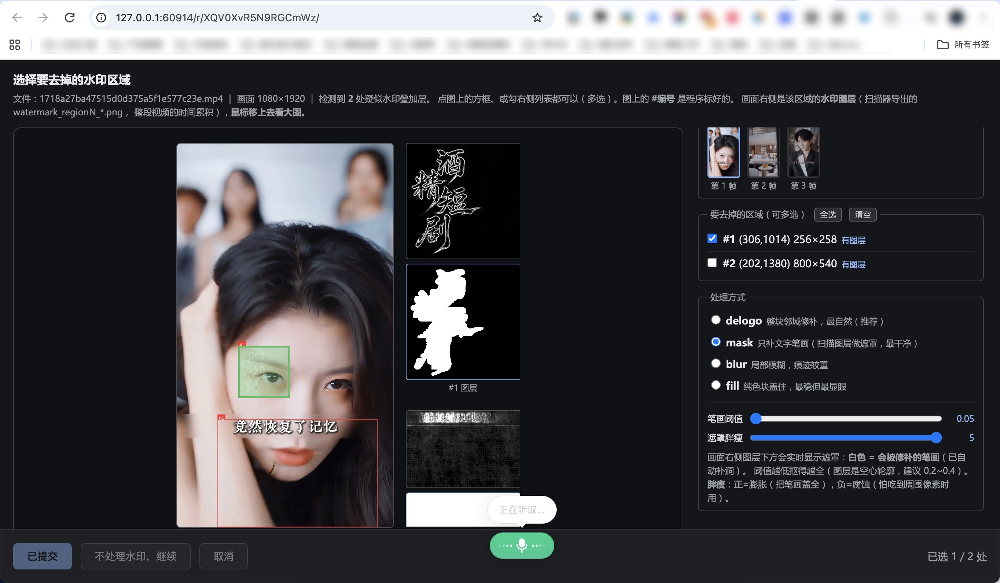

# video_scan_clean

扫描各种平台（抖音、小红书）下载的视频的隐藏数据 + 清楚工具。异步、批量、自动控制并发。清理视频中的各种平台数据，比如 VID 类型的 暗水印。并且支持去水印。

```
扫描（找出画面与声音之外夹带的东西）
  ├─ 元数据里的平台视频 ID（如抖音 vid:）、编码器指纹
  ├─ H.264/H.265 SEI 私有数据（user_data_unregistered + 厂商 UUID）
  ├─ mdat 里不被任何 sample 引用的“缝隙”字节、尾部附加数据、free 盒夹带
  ├─ 嵌入的 ZIP/PDF/图片/私钥等文件（带二次结构校验）
  ├─ 非音视频数据流（字幕/data/timecode/hint）
  ├─ 音频超声水印、持续窄带单音
  ├─ 画面里的烧录水印 / 烧录标识 / 台标 / 烧录文字 / 结构痕迹
  ├─ 单帧插入（闪帧）与矩形码（QR 类）
  ├─ C2PA 内容凭证
  ├─ moov盒数据
  ├─ DRM头信息
  ├─ 缩略图与封面图
  └─ 结构自洽性（SPS 分辨率 vs 容器声明、零时长帧、edit list…）

修复（按风险分三层，逐层加深）
  ├─ Tier A  等长字节补丁    文件长度不变、stco 不用动 → 零播放风险
  ├─ Tier B  ffmpeg 重封装   容器重建，只留真画面+声音 → 画质零损失（默认执行）
  └─ Tier C  重编码去水印    唯一有损的一层，默认关闭
```
### 去水印功能界面展示


## 概念：这四个词是什么关系

```
扫描 scan    = 只看，绝对不改文件
修复 repair  = 会改文件的**总称**（「清理」是它的一部分，不是跟它并列的另一件事）
   ├─ ① 基础整理（默认必做）：涂掉藏在里面的标记 —— vid 视频号 / 编码器指纹 / SEI / 缝隙垃圾
   ├─ ② 外包装清理（默认必做）：重写一遍文件，丢掉封面图 / 字幕轨 / 章节 / 全部元数据
   └─ ③ 去水印（可选，默认关）：重编码，**唯一有损**的一步
```

`清理 ⊂ 修复`，两者不互斥：所谓「只选择性清理」就是**把第 ② 步关掉**（`--minimal`）。
`clean` 是默认档的别名 —— `python main.py clean x.mp4` 和 `python main.py x.mp4` 完全等价。

## 快速开始

```bash
python main.py 视频.mp4                       # 扫描 + 完整清理 + 修复（默认，不用写任何参数）
python main.py ./videos -o ./out --jobs 2     # 批量，限制并发 2
python main.py 视频.mp4 --export-to-source    # 修复结果放到原视频旁边（<原目录>/repaired/）
python main.py 视频.mp4 --wm-ask              # 额外去掉画面里可见的水印（有损，弹窗勾选区域）
python main.py repair 视频.mp4 --minimal      # 最保守：不重写文件，只涂掉几个标记
python main.py scan 视频.mp4 --deep           # 只扫描
python main.py slim 视频.mp4                  # 画质优先瘦身（独立一条线）
python main.py --device-info                  # 看这台机器会自动开多少并发
python main.py 视频.mp4 --dry-run             # 只列出将要处理什么
python main.py --wm-ask --export-to-source    # 全部清理 + 弹窗勾选去水印
```

**默认档就是「完全清理」，不需要任何参数。** 以前要手写的
`--vid blank --encoder blank --remux always --clean` 现在全部自动推导：

| 以前要写 | 现在 |
|---|---|
| `--vid blank` | 自动（vid 一律置空） |
| `--encoder blank` | 自动（encoder/©too 一律置空） |
| `--sei all` | 自动：**SDR 删全部 SEI；HDR 只删私有 `user_data`，保留 HDR 静态元数据**（否则画面发灰） |
| `--remux always --clean` | 自动（重写文件，只留画面 + 声音） |

这几个旧参数**仍然接受**（只是不再显示在 `--help` 里），所以你之前写好的命令不会失效。
唯一的保守逃生门是 `--minimal`（旧名 `--tier-a-only` 仍可用）。

> ⚠️ 老参数里有个反直觉的坑：`--sei none` 的语义是「**一个都不删**」(remove none)，
> 不是「全删」。全删是 `--sei all`。新代码把 `none` 当 `keep` 的别名兼容，正常用法不用再碰它。

### 清理范围（会清什么 / 不会清什么）

| 会清掉 | 靠哪一层 |
|---|---|
| `vid:` 平台视频 ID、encoder/©too 等编码器指纹 | Tier A 等长改写 |
| 码流里的 SEI（SDR 全删；HDR 只删私有 `user_data`） | Tier A 换等长 filler NAL |
| mdat 缝隙 / 尾部附加数据 / free 盒夹带 | Tier A 清零 + Tier B 丢弃 |
| 封面图与缩略图、字幕/data/timecode/hint 轨、章节 | Tier B（`--clean` 的 map 组合） |
| 全部容器元数据（title/artist/date/GPS/自定义键…） | Tier B（`-map_metadata -1`） |
| 未知/私有顶层盒（C2PA 的 `uuid`/`jumb`、DRM 的 `pssh`…） | Tier B 重建容器时自然丢弃 |
| 画面里**可见的**烧录水印/台标 | 只有显式开 Tier C（`--wm*`），有损 |

**不会清掉的**（代码里也有一条同样的注释清单，见 `mp4tool/repair.py`）：

- **音频域水印**（超声载波 / 扩频 / 窄带单音）：本模块没有任何音频处理，音频一律 `-c:a copy`；扫描器只能**检测**，不能去除。
- **像素域不可见水印**（空域/变换域图案、时间维调制）：Tier C 只处理你用 `--wm-region` / `--wm-ask` 圈出来的**可见**区域。
- **HDR 静态元数据**（mastering display / CLL）：HDR 片源上**刻意保留**，是设计不是遗漏。
- **内容指纹**（感知哈希 / 音频指纹）：由画面和声音本身决定，改容器和元数据都动不了它。
- **文件名**：当文件名就是内容哈希时扫描器会报 HIGH，但修复不改名（除非 `--rename-hash`）。

**依赖**：Python 3.9+、`ffmpeg`、`ffprobe`；
`numpy`（画面/音频分析）、`Pillow`（图层导出）；
可选 `tesseract`（水印文字 OCR，装 `chi_sim` 语言包才能认中文）；
可选 `psutil`（更准的内存探测，没有就用 `vm_stat` / `/proc/meminfo`）。

```bash
pip install -r requirements.txt
```

## 输出结构

```
output/
├── index.json                       批次汇总（设备、并发、峰值、每个视频的结果）
└── <视频名>/
    ├── scan/
    │   ├── scan_report.txt          人读报告（14 个检查项 + ASCII 渲染的水印图层）
    │   ├── scan_report.json         机读报告
    │   └── artifacts/<视频名>/       证据：SEI 原始字节、水印放大图、频谱图、可疑帧
    ├── repaired/
    │   ├── <视频名>.repaired.mp4     修复后的视频
    │   └── repair_report.txt         补丁清单 + 验证结果 + 修复前后扫描对比
    ├── pipeline.log                 这个视频的完整过程日志
    ├── summary.json / summary.txt   单个视频的汇总
    └── .work/                       中间文件（默认自动清理，--keep-work 保留）
```

## 项目结构

```
main.py                     顶层入口
mp4tool/
  cli.py                    参数解析 + 三种模式（all / scan / repair）
  pipeline.py               批量编排：并发调度、输出目录、汇总
  scanner.py                14 项检查（ScanSession）
  repair.py                 分层修复（RepairSession）+ 验证
  resources.py              设备探测 + 并发调控（Governor）
  ffmpeg_async.py           异步 ffmpeg/ffprobe + 流式帧解码
  mp4box.py                 容器解析：box 树、sample 表、字节区间、签名与指纹规则
  detect.py                 感知层算法：水印、矩形码、频谱、SEI/SPS
  utils.py                  通用工具
mp4_hidden_data_scan.py     兼容薄壳 → main.py scan
mp4_repair.py               兼容薄壳 → main.py repair
```

## 并发模型（为什么不会把机器跑卡）

三层保护：

**1. 静态预算** —— 开机探测物理核数、内存、是否电池供电，算出理论上限：

```
limit       = clamp(min(physical_cpus × 0.75 / job_threads, (内存 - 2GB) / 700MB, 6), 1, 6)
job_threads = clamp(physical_cpus / 4, 1, 4)      # 每个视频峰值会同时跑 2 个解码进程
电池供电时 limit 减半
```

**2. 准入控制** —— 每个新任务开始前检查 1 分钟负载和可用内存，
吃紧就先等（每 2 秒复查），而不是硬上。**第一个任务永远放行**：
资源检查是用来拦住「再加一个」的冲动，而不是让单个视频在机器本来就忙时干等。

**3. 进程降级** —— 所有 ffmpeg 走 `nice`，并用 `--threads` 限制单进程线程数，
避免 N 个 ffmpeg 各开满核互相抢。

`--priority` 可以选择降级强度，实测（8 核 Mac，3 分钟 1080p 采样解码）：

| 等级 | 前缀 | 耗时 |
|---|---|---|
| 0 | 无 | 3.2s |
| 1 | `nice -n 5` | 3.0s |
| **2（默认）** | `nice -n 10` | 3.0s |
| 3 | `taskpolicy -b` | **29.0s** |

macOS 基本忽略 `nice`，但 `taskpolicy -b`（后台 QoS）会把进程压到能效核并严格限流，
慢约 9 倍。所以默认只用 `nice`，把 `taskpolicy` 留给「我要干活，别卡我」的场景。

## 性能

### 并发实测（8 核 / 8GB，3 个相同的 3 分钟 1080p 视频，含修复验证）

| 并发数 | 总耗时 | 单视频扫描 | 峰值并发 |
|---|---|---|---|
| 1（串行） | ~53s | 13.3s | 1 |
| **2（默认）** | **50.3s** | 22.8s | 2 |
| 3 | 47.6s | 33.7s | 3 |

扫描是**解码密集型**任务，并发收益不大（1→3 只快 10%），但代价是单个视频明显变慢、
机器更烫。所以默认取 `物理核数 / 4`，把「跑满但保持可用」放在第一位；
想要更快就 `--jobs N` 手动加。

> 顺带一个大坑：numpy/BLAS **默认会为每个矩阵运算开满核数的线程**。3 个视频并发时
> N 个任务 × M 个线程互相抢，实测把 load average 顶到 **27**，触发节流反而更慢。
> 所以在 `mp4tool/__init__.py` 里把 `OMP_NUM_THREADS` / `OPENBLAS_NUM_THREADS` /
> `VECLIB_MAXIMUM_THREADS` 等全部设成 1（必须在 numpy 导入之前）。

### 单视频扫描提速

对同一个 3 分钟 1080p 视频（5387 帧）做全量扫描：

| 版本 | 耗时 |
|---|---|
| 旧版（同步，串行） | 52.7s |
| **本版（异步，单次解码）** | **13.3s** |

`quick` 模式（只做静态/容器分析）：1.8s。

重构后 Tier A 输出与旧工具**逐字节完全一致**（MD5 相同），确认没有行为漂移。

主要来自三处优化：

1. **一次解码喂多个消费者**。旧版为了「逐帧异常 / 静态叠加 / 矩形码」分别解码了
   3 次，还额外解了一遍 1080p 用于图层导出，共 4 次。现在两个解码进程并发
   （全帧率极小 RGB 做逐帧统计；采样帧灰度做水印 + 矩形码），总解码量降到约 1/4。
2. **检测在降采样帧上做**。时间中位数要在 `180 × H × W` 上排序，是全流程最贵的一步；
   检测本身不需要全分辨率，降 2 倍后代价降为 1/4。图层提取改成**只对候选区域裁剪**
   后再求梯度中位数，从整帧的几秒降到几十毫秒。
3. **哈希合并成一次遍历**，字符串/签名扫描只在「结构性字节区」做（不扫压缩码流噪声）。

异步化本身也省掉了若干次进程启动：静态检查整批丢进一个线程池调用，
画面/音频分析走异步 ffmpeg，长短任务不再互相阻塞事件循环。

## 修复的三层

### Tier A —— 等长原地改写（默认全开，零风险）

`moov` 在 `mdat` 前面，而 `stco` 存的是**绝对文件偏移**。所以只要改动不改变任何长度，
`stco` 一个字节都不用动，播放行为 100% 一致。

| 补丁 | 做法 |
|---|---|
| vid / 编码器字段 | 等长改写或填 0 清空（**默认置空**） |
| SEI 私有数据 | **原地换成等长的 filler NAL(type 12)** —— 长度不变、解码器本来就丢弃它。<br>**默认自动决定**：SDR 删全部 SEI；HDR 只删私有 `user_data`，保留 HDR 静态元数据 |
| 无引用字节 | 尾部附加 / mdat 缝隙 / free 盒内容整段清零（保留盒头，长度不变） |

### Tier B —— 无损重封装（默认执行）

`ffmpeg -c copy` 重建容器，丢掉 `free` 盒、尾部垃圾、未知顶层 box。**码流一字节不改**。

默认档（`--clean`）用的是这套映射：

```
-map 0:V?  -map 0:a?          # V = 非附加图片的视频流（自动排除 attached_pic 封面图）
-map_metadata -1              # 丢掉全部容器元数据
-map_chapters -1              # 丢掉章节
```

也就是**只留真画面 + 声音**：封面图/缩略图、字幕/data/timecode/hint 轨、章节、
`title`/`artist`/`date`/GPS/自定义键全部不进入输出。

用 `--minimal` 可以退回「不重写文件、只涂掉几个标记」的最保守档：
文件长度和结构完全不变，播放风险最低，代价是封面图/字幕/标题等外包装会留下。
显式写 `--remux never/auto` 也仍然生效（旧命令兼容）。

### Tier C —— 有损重编码（默认关闭）

水印在像素里，有四种做法（`--wm`）：

| 模式 | 做法 | 代价 |
|---|---|---|
| `delogo`（默认推荐） | 整个矩形区域做邻域插值修补 | 区域大时会有涂抹感 |
| **`mask`** | 用扫描导出的**水印图层**（`watermark_regionN_*.png`，多帧梯度中位数）阈值化成**笔画遮罩**，交给 ffmpeg `removelogo` —— **只补文字/logo 的笔画像素**，区域里其余画面原样保留 | 依赖扫描产物；阈值/膨胀要按片源微调（`--wm-mask-threshold` / `--wm-mask-dilate`） |
| `blur` | 局部模糊 | 痕迹明显 |
| `fill` | 纯色块盖住 | 最稳但最显眼 |

`mask` 是目前最干净的方案：它不糊整块，只抹笔画。但它需要扫描时导出过图层
（扫描器最多导出前 3 处），拿不到时会自动回退到 `delogo`。
视频重编码、**音频直接 copy**。区域会自动收进画面内并留 1px 边距。
体积会明显变大（CRF 18 约 3.1 Mbps，可用 `--wm-crf` 调）。

#### 交互式勾选区域：`--wm-ask`

```bash
python main.py 视频.mp4 --wm-ask                 # 检测到水印后弹界面，自己勾选
python main.py 视频.mp4 --wm-ask --wm delogo     # 指定默认处理方式（界面上还能改）
python main.py 视频.mp4 --wm-ask --wm-ask-timeout 300   # 最多等 5 分钟
```

流程是：扫描 → 在几个代表性时间点抽帧、把每处水印框出来并编号 →
在浏览器里打开选择界面（可点方框或勾列表、多选、选 fill/blur/delogo）→ 只处理你勾中的区域。

三个关键设计（都是需求里明确要求的）：

- **不卡死批量**：等待用户选择时**不占用并发槽位**，事件循环也不被阻塞，
  所以一个视频停在那里等你点，其它视频的扫描/修复照常跑；其它需要弹窗的视频会排队，
  一次只开一个界面。
- **失败必须安全**：端口不可用、打不开浏览器、用户直接关页面、界面出错 —— 任何一种
  都只会退化成「不处理水印」，绝不会中断批量。
- **不依赖 tkinter**：用标准库 `http.server` + 本机浏览器实现。macOS 上
  pyenv / Homebrew 装的 Python 默认不带 `_tkinter`（本项目开发机实测就是
  `ModuleNotFoundError: No module named '_tkinter'`），用 tkinter 的弹窗在这类环境里直接不可用。
- **界面和逻辑分开**：HTML/CSS/JS 全在 `mp4tool/wm_picker_page.html`，
  改样式或交互直接编辑它即可 —— 按 mtime 缓存，**改完重跑就生效，不用动 Python**。
  `mp4tool/wm_picker.py` 只负责取帧、画标注、起 HTTP 服务、收结果。
  模板文件缺失时会优雅跳过（当作「不处理水印」），不会卡住流程。

  > 注意：图上的 `#1/#2…` 编号是 Python 端用 PIL **烧进图片里**的，
  > 所以 HTML 里只画透明的可点击框 + 选中态，**不要再画一遍编号**，否则会出现两套数字。

抽 3 帧（25% / 50% / 75%）是因为有些视频的水印只在中段或片尾出现，单抽一帧可能正好看不见。
标注图存在 `<输出>/<视频名>/scan/wm_select/`，界面上也可以随时切帧查看。

> 说清楚一件事：**去掉画面里肉眼可见的台标/烧录水印，不会改变视频的内容指纹**
> （感知哈希/音频指纹看的是整体像素与声音，一个 logo 区域盖掉与否几乎不影响）。
> 这一层解决的是「画面里有个碍眼的水印」，不是「让平台认不出这条视频」。

### 后置复扫（重要）

ffmpeg 重封装时会**把它自己的编码器标签重新写进元数据**（实测把 `Lavf58.76.100`
换成 `Lavf61.7.100`），把 `--encoder blank` 直接覆盖掉；libx264 还会塞进自己的 SEI，
而且所有偏移都变了。所以每做完 Tier B / C，都会对新文件**重新定位并再跑一遍等长清理**。

## 验证

每次修复都会做：

1. 流结构对比（编码、分辨率、采样率、声道、容器帧数）
2. 时长对比（差异 > 50ms 报错）
3. 全片解码（`ffmpeg -f null -`），要求零错误
4. Tier A 等长校验：逐字节 diff，断言**每个差异区间都落在预期补丁范围内**
5. 修复前后扫描对比：用扫描器**沿用原报告的扫描深度**复扫输出，列出「已消除 / 仍存在 / 新增」

第 5 条有个坑：如果复扫用 `--quick` 而原报告是 `--deep`，会把「深度模式才有的发现」
误报成「已消除」。所以扫描报告里会记录本次的选项，复扫时沿用。

## 实测结论（仓库里那个视频）

```
扫描: 高=6 中=1 低=2 信息=13
  高  文件名 = 文件 MD5（内容寻址命名）
  高  comment 里藏着抖音视频 ID: vid:v0300fg10000dajpti7og65jr7nm1mog
  高  码流里有 SEI user_data_unregistered（UUID dc45e9bd…eeef，payload bvc0ot v2.2.1.3-20250220）
  高  画面底部一处烧录文字水印 + 中部一处小叠加层
  中  SEI UUID 命中已知指纹
  低  两条轨道各有一条 edit list

没有发现: mdat 缝隙(0B) / 尾部附加 / free 盒夹带 / 嵌入文件 / 额外数据流 /
          超声水印 / 单帧插入 / 矩形码
```

> **关于那个 SEI UUID**：`dc45e9bd-e6d9-48b7-962c-d820d923eeef` 是 **x264/x265 系编码器
> 写版本信息用的公共 UUID**（实测 libx264 在这个 UUID 下写出 `x264 - core 164 r3108 …`）。
> 原文件那句很短的 `bvc0ot v2.2.1.3-20250220` 说明它出自一个**基于 x264 定制/封装的编码器**。

修复（`--vid blank --encoder blank`）：3 个补丁 / 95 字节，文件大小不变，
全片解码零错误，逐字节差异 94 字节且全部落在预期区间内，复扫后高危项归零。

## 设计上的坑（都踩过并修了）

- **mdat 缝隙**要按所有轨道 sample 的**并集**算。按单轨算会把音频填满视频间隙的区域
  误判成 22MB 的隐藏数据。
- **字符串/签名扫描**只在「结构性字节区」做。压缩码流本身接近随机字节，在里面找
  URL/邮箱/文件头必然全是误报（早期版本从码流里「找出」了 9 个 Windows PE 头）。
- **vid 的判定要看值的内容，不看键名**。键名可能是 `comment`、`©cmt` 或数字序号，
  取决于容器是 mdta 风格还是 iTunes 风格 —— 而 ffmpeg 重编码会**自动换风格**，
  只按键名匹配会让改过的 ID 在重编码后原样活下来。
- **`ilst` 下用数字序号当类型的子盒**需要显式递归解析，否则拿不到元数据的真实偏移。
- **`taskpolicy -b` 会让 ffmpeg 慢 9 倍**（见上表），不能作为默认降级手段。
- **`rawvideo` 输出的默认同步模式是 CFR，会把「稀疏抽帧」重复填满**。
  `-vf select='eq(n,1382)+eq(n,50619)'` 只想要 2 帧，但 `-f rawvideo` 默认
  `-fps_mode cfr`，ffmpeg 为了让输出还是恒定帧率，会把选中的帧**复制补齐**
  —— 实测一个 1689s / 50672 帧的视频因此吐出了约 50620 帧（23.6 GB），
  再叠加每帧的 QR 检测就是二十多分钟的「假死」。抽帧场景必须
  `-fps_mode passthrough`（`stream_rawvideo` 的 `fps_mode=` 参数），
  并用 `-frames:v N` 兜底。逐帧 MD5 验证过：那些重复帧和原帧**逐字节相同**，
  剔掉它们不损失任何检测覆盖。
- **固定内存阈值会误判**。macOS 常态可用内存本来就不高，8GB 机器上 1200MB 的硬阈值
  会让任务一直等待；改成按总内存自适应（1/12，夹在 400MB~1200MB）。

## 跨平台（Windows / macOS / Linux）

代码里所有平台相关的地方都做了分支，macOS 上的行为与之前**逐字节一致**：

| 方面 | macOS / Linux | Windows |
|---|---|---|
| 进程降级 | `nice -n 5/10`，级别 3 用 `taskpolicy -b` | `creationflags`：`BELOW_NORMAL_PRIORITY_CLASS` / `IDLE_PRIORITY_CLASS` |
| 杀进程树 | `os.killpg(os.getpgid(pid), SIGKILL)` | `taskkill /F /T /PID`（失败回退 `proc.kill()`） |
| 新会话 | `start_new_session=True` | 不传（改传 `creationflags`） |
| 内存探测 | `sysctl hw.memsize` / `vm_stat` / `/proc/meminfo` | `GlobalMemoryStatusEx`（ctypes），有 psutil 时优先用 psutil |
| 电池检测 | `pmset -g batt` | `GetSystemPowerStatus` |
| 物理核数 | `sysctl` / `/proc/cpuinfo` | psutil，退化到 `os.cpu_count()` |
| 控制台编码 | 本来就是 UTF-8 | `setup_console_utf8()` 把 stdout/stderr 切成 UTF-8/`errors=replace`，否则 `✔ ✗ ⚠` 在 cp936/cp1252 重定向下会 `UnicodeEncodeError` |
| 目录名 | 直接截断到 80 字符 | 额外去掉结尾的 `.`/空格，并避开 `CON`/`PRN`/`AUX`/`NUL`/`COM1-9`/`LPT1-9` 这些保留名 |

交互式选择界面用的是浏览器方案（标准库 `http.server`），三个平台都不需要额外依赖。

已知限制：Windows 上 `cpu_busy_percent()` 返回「采样失败」哨兵值，所以
**CPU 压力节流在 Windows 上不生效**（并发上限、内存下限仍然生效）。

## 画质优先瘦身（`slim`，独立于扫描/修复）

```bash
python slim.py video.mp4                         # 独立入口
python main.py slim video.mp4                    # 等价写法
python slim.py ./videos -o ./slim_out --jobs 2   # 批量
```

瘦身是一条**完全独立**的线：不读扫描报告、不碰 Tier A/B/C、默认输出到 `./slim_output/`。
代码在 `mp4tool/slim.py`，入口 `slim.py`。

大前提是**宁可瘦不了多少，也绝不让画面变糊**。所以设计目标不是「压到某个体积」，
而是「先定一个感知质量下限，再在这个下限之上尽量压」：

1. **用 VMAF 当裁判**（本机 ffmpeg 带 `libvmaf`；没有就退 SSIM）。VMAF 量的是人眼看到的差异，
   而不是逐字节差异 —— 这才是「清晰度」这件事的可量化定义。
2. **先小样校准，再全片编码**：拿 2 段 3 秒小样试编，达不到质量下限就把 CRF 往**更清晰**的方向调；
   全片压完**再抽 3 段复验**，不达标就**丢弃输出、保留原文件**。
   所以最坏的结果是「没瘦下来」，而不是「糊了」。
3. **成品必过全片解码**（`ffmpeg -f null -` 零错误）才算数，否则直接丢弃。
4. **绝不默认降分辨率/降帧率**（那是最伤清晰度的两件事），要 `--allow-downscale --max-height` 才开；
   10bit 源保持 10bit，避免 banding。
5. **不划算就不做**：按校准结果推算省不到 `--min-savings`（默认 10%）就直接跳过，不动原文件。
6. **音频默认 copy**（音频不属于「画面清晰度」，重编只会更差）；只有无损音频或码率 > 256k 才转 AAC 192k。
7. **自动挑编码器**：默认在 `libx265` / `libx264` 里选「质量达标且更小」的那个；
   AV1 必须显式 `--encoder libsvtav1`（兼容性不如 h264/h265 稳）；也支持 VideoToolbox 硬件编码
   （很快，但同画质下文件更大）。hevc 输出自动打 `-tag:v hvc1`，苹果生态才认。
8. **HDR 默认跳过**（重编容易弄丢 HDR 元数据导致发灰发白），`--allow-hdr` 才处理。

质量档 `--quality`：`transparent`（VMAF ≥ 97）/ `high`（≥ 95，默认）/ `balanced`（≥ 93）。

输出：`<outdir>/<视频名>/<视频名>.slim.mp4` 和 `slim_report.txt`（里面记录了每一个决策及理由，
包括试过哪些编码器、每档的实测 VMAF 与预计体积）。

## 注意

- 改元数据（Tier A/B）对**对抗平台内容识别基本无效**：内容识别走感知哈希和音频指纹，
  看的是像素和声音；`vid:` 和 SEI 只是给人看的溯源标签。真正改画面的是 Tier C，
  而它不可逆、区域大时效果一般。
- `--vid blank` 才算「删除」，`--vid random`（默认）只是换成另一个同格式 ID。
- 本工具用于**去标识、清理自己视频的元数据、遮盖自己视频里的水印**这类操作；
  视频不是你的，或者要绕开平台内容保护，不在适用范围内。
